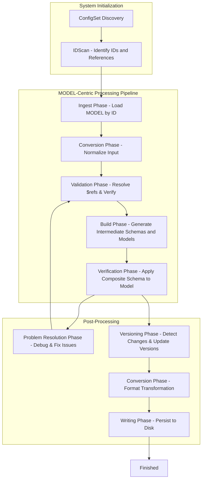

### 📄 **Configuration Processing Pipeline Documentation**

This document outlines the modular phases involved in processing configuration files for validation, transformation, and serialization.

---

### 🔄 **System Startup - Clean State Initialization**

#### ✅ **1. ConfigSet Discovery**
- Scans the project directories to detect available configuration sets (`schemas/`, `models/`, `instances/`).
- Establishes a clear mapping between the discovered configuration sets and their associated files.

#### ✅ **2. IDScan**
- Scans all files in a discovered ConfigSet to identify `$id`, `$version`, and `$ref` entries.
- Generates a mapping of:
  - `MODEL ID -> File Path`
  - `SCHEMA ID -> File Path`
- Prepares for caching strategies by recording metadata such as timestamps and file hashes.
- Extensible to allow:
  - MODEL definitions for accessing data (e.g., from DB connections, queries).
  - Future improvements in performance with caching of scan results.

---

### ⚙️ **MODEL-Centric Processing Pipeline**

#### ✅ **1. Ingest Phase - Targeted Data Loading**
- Given a `MODEL ID`, ingest the relevant file.
- Load its content into memory (resolving file formats like JSON, YAML).
- Track discovered `$ref` links.

#### ✅ **2. Conversion Phase - Normalize to Internal Format**
- Convert the ingested model into a consistent internal data structure.
- Apply transformations to standardize across formats (e.g., resolving shorthand syntax).
- Attach metadata (`$id`, source, etc.).

#### ✅ **3. Validation Phase - Basic Integrity Checks**
- Confirm the existence of:
  - `$id`
  - Valid `$version`
  - Valid `$ref` links (resolving references recursively if needed)
- Resolve `$ref` links:
  - Ingest referenced schemas/models on-demand.
  - Cache resolved objects for future requests.

#### ✅ **4. Build Phase - Intermediate Object Generation**
- **Schemas:**
  - Merge `allOf`, resolve `$ref`, and combine inherited schemas.
  - Write intermediate schemas to `configset/.temp/schemas/{schema-id}.json`.
- **Models:**
  - Resolve `inheritsFrom` links.
  - Combine inherited fields and override conflicts.
  - Write intermediate models to `configset/.temp/models/{model-id}.json`.

#### ✅ **5. Verification Phase - Model Validation**
- Apply the composite schema to the composed model.
- Validate:
  - Required fields
  - Data type correctness
  - Custom validation logic
- Store diagnostic output in the Problems pane (VSCode integration).

#### ✅ **6. Problem Resolution Phase - Iterative Debugging**
- Report issues with references to:
  - Source schema/model
  - File path and line number for direct debugging
- Allow quick-fix code actions (e.g., auto-generate missing references)

#### ✅ **7. Versioning Phase - Apply Change Detection**
- Compare version metadata to detect changes.
- Avoid rewriting unchanged models/schemas.
- Update version numbers where applicable (e.g., semantic versioning).

#### ✅ **8. Output Conversion Phase - Format Transformation**
- Convert internal representations into:
  - JSON
  - YAML
  - Other custom formats as needed

#### ✅ **9. Writing / Serialization Phase - Persist Final Output**
- Write finalized configurations to disk.
- Manage version history and clear previous temporary files.

---

### 📊 **Processing Flow Visualization (Mermaid)**

